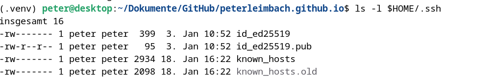

# Generating ssh keys

For ssh login with ssh keys, ssh keys must be generated for the user on the client.

The configuration on the server must be changed so that login with ssh keys is permitted.

A login for the root user as well as a login with password should be prohibited for security reasons.

## Generation of the key on the client

A password for the key can be specified during generation so that the key can only be used after the password has been entered.
Otherwise, it is sufficient to obtain the ssh key.

``` sh
$ ssh-keygen -t ed25519
```

By default, the keys are stored in the ```$HOME/.ssh/``` folder.

The private key is protected by the access rights so that only the respective user can access it!

The public key can be read by anyone.



## enter the key on the ssh server

For the login to work on the ssh server, the public key must be entered on the server in the file ```$HOME/.ssh/authorized_keys```.

This key and the ```$HOME``` is protected by the access rights so that only the respective user can access it!