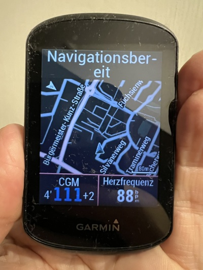

# my setup for looping

## CGMS

I use a Dexcom G6 as CGMS.

I am very happy with this as the Dexcom G6 is from my point of view a very good product and fortunately my german health insurance is covering this.

I use the BYODA app for reading the data from the CGMS and broadcasting it to my loop app AndroidAPS and the Dexcom CLARITY.

The user interface is the same as for the standard Dexcom G6 app and the data is also forwarded to AndroidAPS. I can use it for looping and for display in the event of a sensor complaint with Dexcom. This has always worked without any problems so far.

I've been thinking about switching to the Dexcom G7 for a while with the last annual prescription in sommer 2023.

However, as the accuracy of the readings is more important to me than the transmitters, which are no longer necessary, I stayed with the Dexcom G6. Of course, it's tempting not to always have to have a spare transmitter to hand, although I haven't had a transmitter break before the usual wearing times in 2.5 years of using the Dexcom G6.

The slightly larger size of the Dexcom G6 is negligible for me personally.

But of course this is always an individual matter.

## Insulin Pump

I am a very satisfied user of a Dana RS insulin pump. I use it since around 5,5 years. 

Even after the agreed 4-year warranty period for the pump has expired, I see no reason to actively consider replacing it.

The decisive factor for me when choosing it was that there is a very good connection to the insulin pump via the open interface (API) and I am very grateful and very satisfied with this.

??? notes information "arguments other people against the use of a Dana RS"

    There are a few points that are mentioned by other interested parties or users, but which do not apply to me:

    1. use of a battery for operation that is not available in the usual shops
    
        I just need to keep a spare battery in stock especially during traveling.

    2. filling the reservoir with insulin via manual presetting of the threaded rod

        I make the fine adjustment as every other user too by a very reliably auxiliary tool supplied.

    3. smaller selection of catheter types.

        There are catheters with Teflon as well as steel needles and I am very satisfied with the Dana insept II.

## Loop app -> AndroidAPS

I have been using AndroidAPS for looping for 5.5 years. I usually use the current master version unless I participate in the pre-tests for the next version. Then I use the version from the dev branch.

While writing this text in January 2024, I am using version 3.2.0.1.

I have made several version changes during this time.

As a rule, there is one major change per year and 2-3 smaller updates, which I usually also carry out, as translating the app is easy for me as a computer scientist.

The time required for me is about 1 hour per update, including installation on the cell phone, backup of the configuration in advance and the app after creation on Google Drive.

!!! note information "time coonsidered is relative"

    Inexperienced users may need considerably longer and may find the update a nervous challenge.

## Nightscout Server

## optional display in office and bed room -> M5 Stack

I use the M5Stack Nightscout monitor an execellent tool to display my most important T1D KPIs on a small screen in office and bed room.

M5Stack Nightscout monitor reads this data from my Nightscout site.

The project can be found at [Github M5Stack Nightscout monitor](https://github.com/mlukasek/M5_NightscoutMon).

## optional display during cycling -> Garmin Edge 530

I use a Garmin edge 530 bike compouter for nagigation during cycling and an additional app on the Garmin GPS bike computer to display the blood glucose from xDrip as a data field on the bike computer. The additional app was developed by Andreas May from the T1D community.

xDrip gets the blood sugar values from AndroidAPS which got it from BYODA. 

The additional app is available free of charge in the official Garmin connect IQ Store.  [Link to Andreas May Data Field App on connect IQ store](https://apps.garmin.com/de-DE/apps/5a3e2cda-12f0-4afd-88ed-000e67a68d84).

Here is a picture of my Garmin Edge 530 bike computer with map, blood sugar and heart rate.

