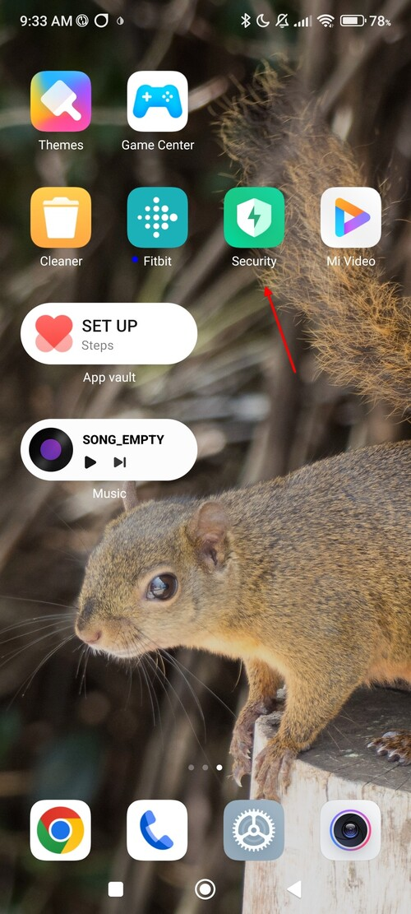
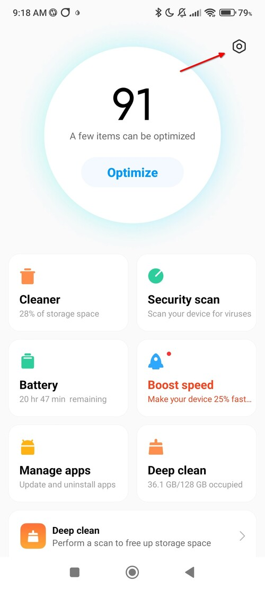
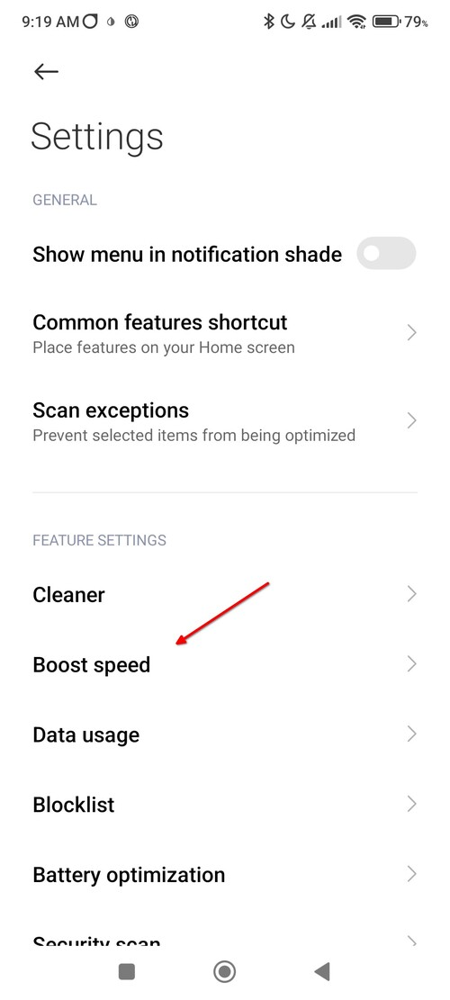
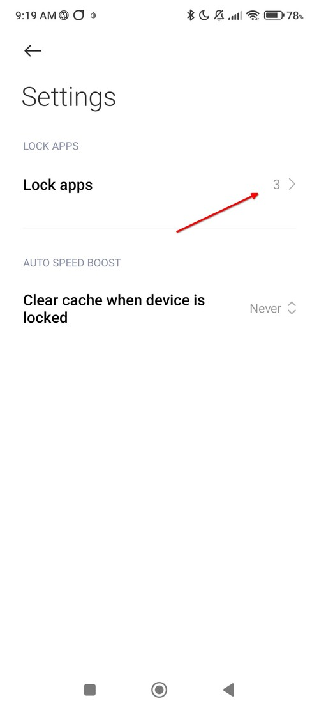
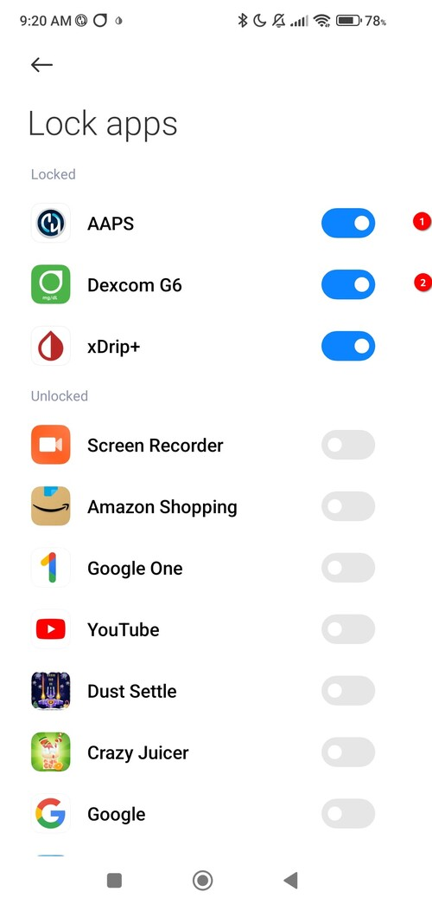

# setup Redmi Note 13 4G for AAPS

After one week of usage I can confirm that the Xiaomi Redmi Note 13 4G works very well for me with MIUI Global 14.0.3 and AAPS 3.2.0.1.

The only limitation for me would be that I did not receive any or only sporadic     CGMS data during an event with about 600 people in an auditorium. However, I believe that this is not due to the device itself, but to the number of Bluetooth devices in a room and other smartphone would have the issue too. As soon as I left the room, reception was immediately restored. Since I rarely attend such events and then only eat food that slowly enters my bloodstream, I don't care.

It was important to make one final change in the security app (not security settings)  otherwise the AAPS app would be stopped by one part of the MIUI operating system of the smartphone and then automatically restarted by another part. That worked too but to be honest is a bit strange for me.

The necessary basic setup is

- disallow energy optimization for BYODA and AAPS,
- disable the Xiaomi app checker,
- set autostart for BYODA and AAPS users and
- disable Play Protect in the Play Store app.

The final step was to enable locking in the security app (not security settings) for AAPS and BYODA.

You can find information to this in the About dialog of AAPS when you follow the "Don't kill my App' link but I searched some time to find the right place to do the settings. Therefore I made a short documentation here.

## Start the security app

## switch to settings

## switch to "Boost speed" settings

## switch to "Lock apps" settings

## activate locking for AAPS and BYODA apps

